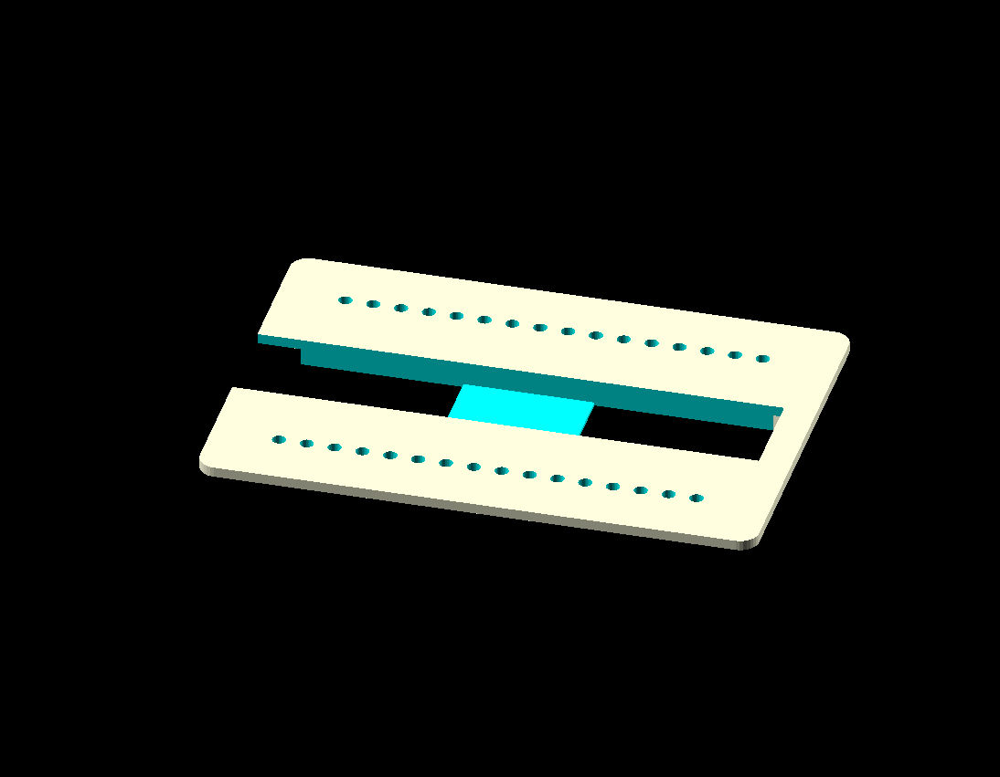
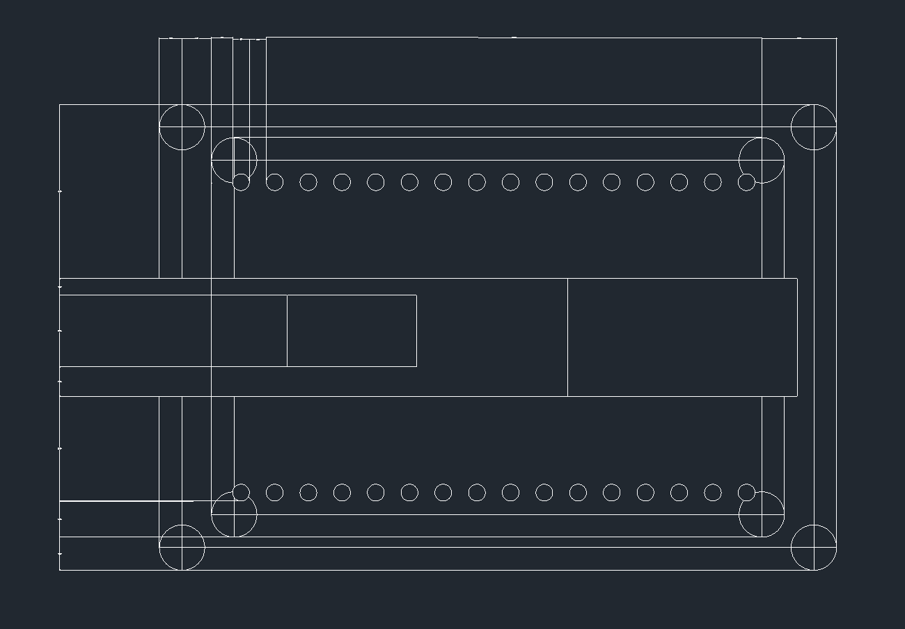
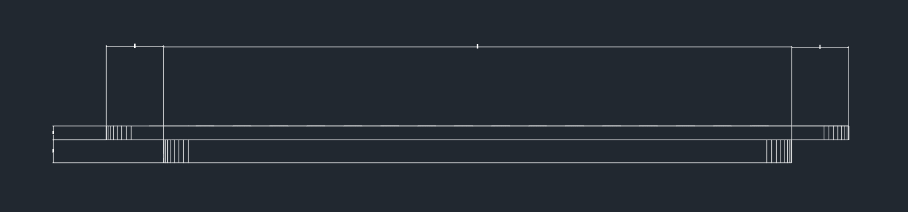
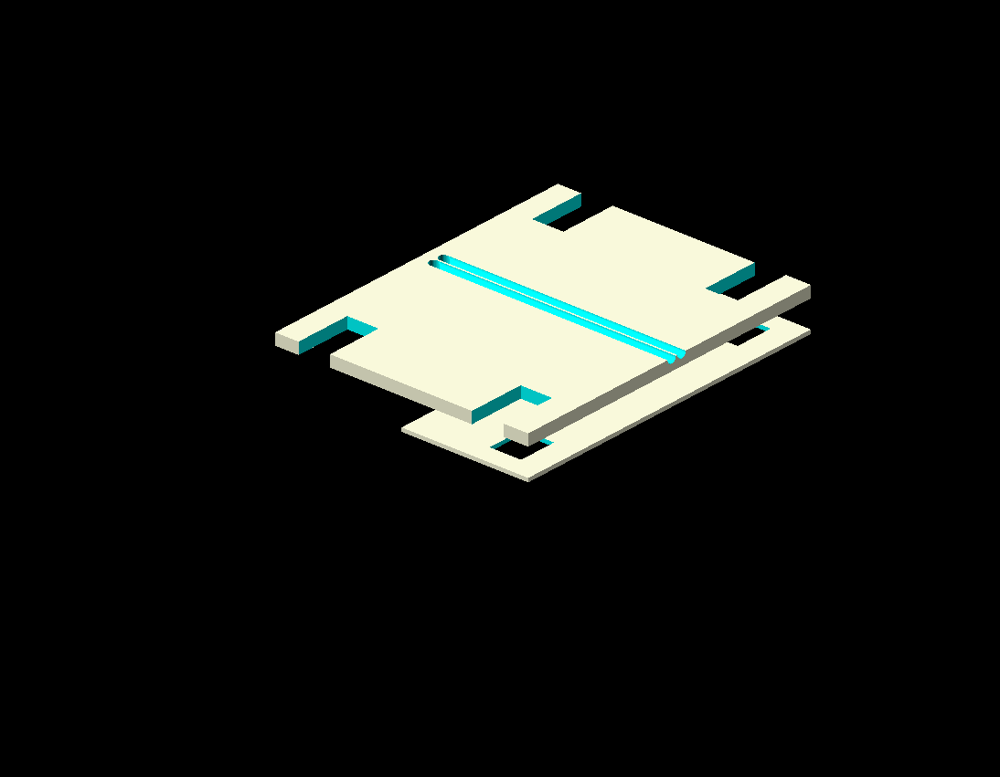
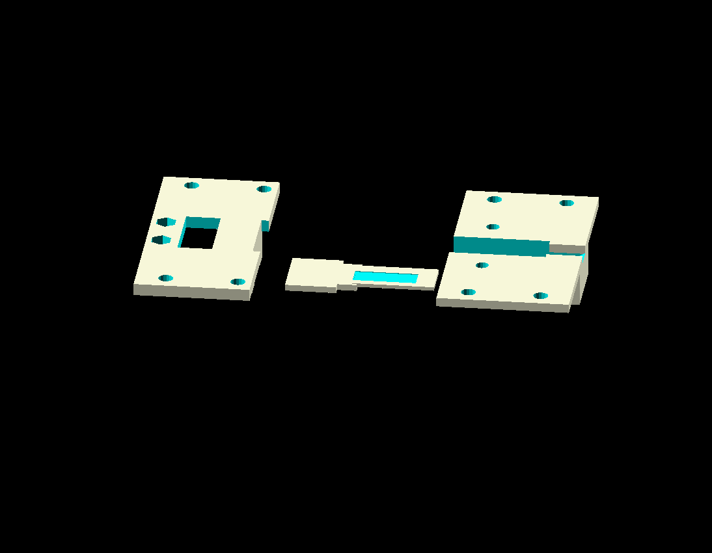

# Piwarmer Programs

We have several programs to heat Illumina chips during each phase of the experiment. Learn more about those [here](piwarmer/).

# Stage Designs 

Parts were designed in OpenSCAD and exported to .dxf (AutoCAD) for machining. We provide OpenSCAD files in case you want to modify the original design, and dxf if you just want to replicate our current setup. 

### Software Versions

We used Autocad 2017 for Windows and OpenScad 2015.03-2 to generate these files.

### Base Plate

The base for the CHAMP microfluidics platform. Used to hold MiSeq chip in place for prism TIRF microscopy. 

| Preview | File |
| --- | --- |
|  | [CHAMP_Base_Plate.scad](stage/CHAMP_Base_Plate.scad) | 
|  | [CHAMP_Base_Plate_1.dxf](stage/CHAMP_Base_Plate_1.dxf) |
|  | [CHAMP_Base_Plate_2.dxf](stage/CHAMP_Base_Plate_2.dxf) |

### Tubing Plates

Pressure plates used to keep tubing in place for efficient fluid flow through CHAMP system. 

| Preview | File |
| --- | --- |
|  | [CHAMP_Tubing_Plates.scad](stage/CHAMP_Tubing_Plates.scad) |
|  | [CHAMP_Tubing_Guide_2.dxf](stage/CHAMP_Tubing_Guide_2.dxf) |

### Tubing Holders 

Keeps the flow cell in place for the duration of experiment. 

| Preview | File |
| --- | --- |
|  | [CHAMP_Holders.scad](stage/CHAMP_Holders.scad) | 
|  | [MiSeq chip holder1-1.dxf](stage/MiSeq chip holder1-1.dxf) |
|  | [MiSeq chip holder1-2.dxf](stage/MiSeq chip holder1-2.dxf) |
|  | [MiSeq chip holder2-1.dxf](stage/MiSeq chip holder2-1.dxf) |
|  | [MiSeq chip holder2-2.dxf](stage/MiSeq chip holder2-2.dxf) |
|  | [MiSeq chip holder2-3.dxf](stage/MiSeq chip holder2-3.dxf) |

